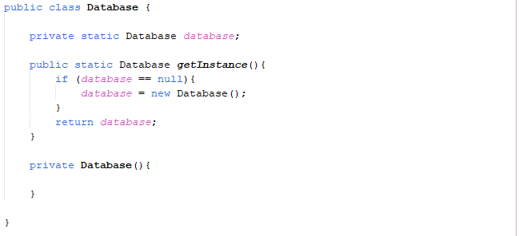

# TUTORIAL SPRING BOOT DASAR

### Inversion of Control
* Inversion of Control (IoC) merupakan prinsip dalam pembuatan perangkat lunak, dimana kita melakukan pemindahan kontrol untuk objek atau program ke sebuah container di framework
* Tidak seperti biasanya ketika kita membuat aplikasi, dimana kita selalu melakukannya secara manual, dalam IoC, kita menyerahkan banyak pekerjakan ke container IoC 
* Container IoC memiliki kontrol untuk melakukan eksekusi program kita, memanajemen object pada program kita dan melakukan abstraction terhadap program kita
* Saat menggunakan framework IoC, kita biasanya akan mengikuti cara kerja framework tersebut

Spring Inversion of Control
* Spring bisa dibilang adalah framework IoC, dimana kita akan menyerahkan banyak sekali pekerjaan dalam program kita ke Spring
* * Kode program kita akan mengikuti cara kerja Spring

### Application Context
* ApplicationContext adalah sebuah interface representasi container IoC di Spring
* ApplicationContext adalah inti dari Spring Framework
* ApplicationContext banyak sekali class implementasinya, secara garis besar dibagi menjadi 2 jenis implementasi, XML dan Annotation
* Pada versi Spring 3, XML masih menjadi pilihan utama, namun sekarang sudah banyak orang beralih dari XML ke Annotation, bahkan Spring Boot pun merekomendasikan menggunakan Annotation untuk membuat aplikasi Spring
* [https://docs.spring.io/spring-framework/docs/current/javadoc-api/org/springframework/context/]ApplicationContext.html 

Configuration
* Untuk membuat ApplicationContext menggunakan Annotation, pertama kita bisa perlu membuat Configuration class
* Configuration Class adalah sebuah class yang terdapat annotation @Configuration pada class tersebut
* Kode : HelloWorldConfiguration

Membuat Application Context
* Selanjutnya, setelah membuat Class Configuration, kita bisa menggunakan class AnnotationConfigApplicationContext untuk membuat Application Context
* [https://docs.spring.io/spring-framework/docs/current/javadoc-api/org/springframework/context/annotation/AnnotationConfigApplicationContext.html] 
* Kode : Membuat Application Context

### Singleton
* Singleton adalah salah satu Design Patterns untuk pembuatan objek, dimana sebuah object hanya dibuat satu kali saja
* Dan ketika kita membutuhkan object tersebut, kita hanya akan menggunakan object yang sama * [https://refactoring.guru/design-patterns/singleto] 

Membuat Singleton di Java
* Ada banyak cara membuat singleton object di Java
* Cara yang paling sering digunakan adalah membuat class yang berisikan static method untuk membuat object dirinya sendiri
* Selanjutnya constructor nya dibuat private, agar tidak bisa diakses dari luar
* Sehingga user terpaksa menggunakan method static tersebut ketika ingin membuat object nya
* Kode : Singleton Class

